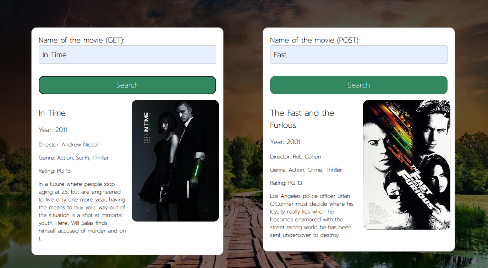
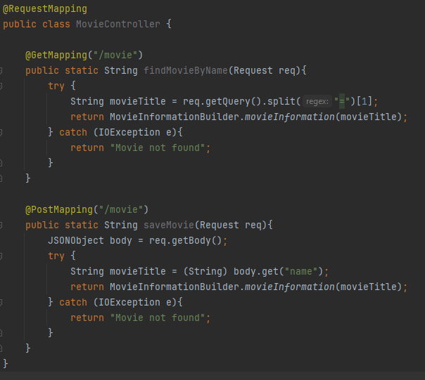
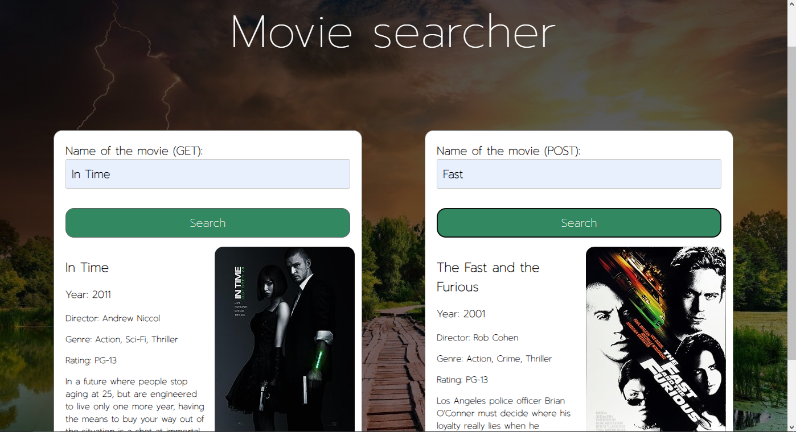
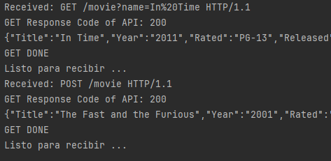

# Taller 4 AREP - Brian Camilo Fajardo Sanchez

Este taller consiste en cambiar la manera en como se realizaban las peticiones http GET y POST
ahora se simula el funcionamiento del framework spring y se usan anotaciones para cargar los componentes


## Iniciando

Estas instrucciones le permitirán disponer de una copia del proyecto en su equipo local para fines de desarrollo y pruebas.


### Prerrequisitos

* Git 
* Java
* Maven

Si aún no cuenta con las tecnologías necesarias aquí hay unos videotutoriales que pueden ser de utilidad.

* Git: https://www.youtube.com/watch?v=4xqVv2lTo40
* Java: https://www.youtube.com/watch?v=BG2OSaxWX4E
* Maven: https://www.youtube.com/watch?v=1QfiyR_PWxU

### Instalando el proyecto

Para poder realizar una copiar del proyecto, primero debes dirigirte al directorio donde deseas almacenar el proyecto y 
abrir un terminal para escribir el siguiente comando:

```
git clone https://github.com/briancfajardo/AREP-Taller4.git
```

Luego, ingresa al directorio del proyecto desde el terminar y ejecuta el siguiente comando para correr el proyecto 

```
mvn exec:java
```

Una vez que el proyecto se encuentre corriendo correctamente y en el terminal aparezca el mensaje de "Listo para recibir..." 
ingresa desde tu navegador predilecto a la dirección http://localhost:35000/index.html. Al ingresar verás dos cuadros de búsqueda,
el primero hace referencia a la búsqueda de películas con el verbo GET y la segunda, haciendo uso de POST.

Nota, una vez escribas el nombre de la película, para realizar la búsqueda puedes darle a la tecla enter o en el botón "Search".




## Corriendo los tests

Para poder correr los test unitarios del proyecto, debes escribir el siguiente comando en un terminal desde el directorio 
del proyecto.

```
mvn test
```

Ahora, el proyecto tiene 2 tests, el primero es una prueba donde vemos que la API que creamos si sea capaz de traer 
información correcta dado el título de una película, y el segundo prueba que nuestra app sea resistente a pedidos 
concurrentes, chequeando que el caché se mantenga consistente a través de estos pedidos.

### Test de integración

La prueba que se realizó para verificar el funcionamiento de nuestra versión de Spring consiste en lo siguiente:

Creación de la clase donde se crearon los servicios REST GET y POST



En la implementación, al igual que en spring, creamos el método findMovieByName
Un método que responderá peticiones GET realizadas a la ruta /movie,
de la misma forma se responden las peticiones POST realizadas al mismo endpoint
con el método llamado saveMovie

Para probar su funcionamiento se usaron dos formularios donde cada uno realiza
peticiones GET y POST respectivamente. 



Y aquí está el log de las peticiones para validar su funcionamiento



## Documentacion

Para poder ver la documentación del proyecto desde el terminal y ubicado en el directorio del proyecto debe ejecutar el 
siguiente comando:

```
mvn javadoc:javadoc
```

En la siguiente ruta se encuentra un archivo (index.html) generado con la documentación del proyecto, el cual puede ser 
abierto mediante un navegador web 

```
./target/site/apidocs/
```

## Construido con

* [Maven](https://maven.apache.org/) - Administrador de dependencias
* [OMDAPI](https://www.omdbapi.com) - API externa de consulta

## Version

1.0-SNAPSHOT

## Autores

Brian Camilo Fajardo Sanchez - [briancfajardo](https://github.com/briancfajardo)

## Licencia

GNU General Public License family

## Diseño

En la aplicación, se ha organizado lógicamente las clases mediante el uso de paquetes para abstraer la arquitectura indicada 
en el enunciado. De acuerdo con las especificaciones, se debían crear 3 componentes, los cuales fueron implementados de la siguiente manera:

* Cliente Web (Web Client): Se ha creado un paquete llamado "webclient" para separar de manera lógica al cliente web. 
En este paquete se encuentra la clase HttpServer, la cual se encarga de gestionar las solicitudes del cliente y enviar 
respuestas a través de los Sockets.
* Fachada del Servidor Web (Web Server Facade): Para este componente, se creó el paquete "api", que contiene las clases 
ConnectionHttp y Cache. Estas clases trabajan en conjunto para consultar la información de la película buscada, ya sea 
realizando una solicitud a la API externa o utilizando la información almacenada en la caché.
* Cliente de Prueba Concurrente en Java (Concurrent Java Test Client): En este caso, se ha utilizado la estructura por 
defecto proporcionada por Maven para realizar pruebas. Si se navega hasta el final de la carpeta de pruebas del proyecto, 
se encontrará la clase de prueba de la API de fachada, donde se verifica la corrección de la información obtenida de la API 
externa y la resistencia a la concurrencia de la caché.

## Arquitectura

Se creó la arquitectura separando lógicamente los componentes en paquetes,
y en este laboratorio se mantuvo ese patrón, por lo que para ser capaces de enviar respuestas leyendo archivos se crearon 
los siguientes paquetes dentro del Web Client:

* File Handler - Para este componente creamos el paquete "filehandlers" para poder responder acordemente a las peticiones 
hechas por el cliente encargado de leer los archivos que se le pida y devolverlos, ya sean archivos de texto, imágenes o 
mensajes de error.
* REST Handler - Para este componente creamos el paquete "resthandler" que es el encargado de enrutar con nuestro "Backend" 
(que sería la fachada) las peticiones REST que se le hagan a nuestro servidor, en este caso la búsqueda de películas.
* mySpring - Para este componente creamos el paquete "mySpring" donde dejamos toda la lógica necesaria para guardar 
funcionalidades en el código para luego buscarlas y correrlas cuando sea necesario

### Extensibilidad

Para realizar una posible extensión se pueden dar dos posibles casos

1. Para cambiar de proveedor de información, en principio solo había que cambiar la información almacenada en la variable 
GET_URL que se encuentra en la clase HttpConnection

2. Para ampliar las funcionalidades que ofrece el buscador, como por ejemplo otro tipo de búsqueda, solo había que generar 
nuevos formularios, dependiendo del tipo de búsqueda que se desee añadir.

### Patrones

Hay un patrón de diseño y un patrón que arquitectura

* Se ha utilizado el patrón de diseño conocido como Singleton en la implementación de la aplicación. Este patrón se adoptó 
debido a la necesidad de contar, por el momento, con un único caché dentro de la aplicación para almacenar las películas.
* La arquitectura adoptada se asemeja a la implementación a bajo nivel de un Message-Oriented Middleware (MOM), ya que 
nuestra fachada, en esencia, funciona como un intermediario que efectúa solicitudes a la API externa y construye la respuesta 
de manera que resulte más fácilmente legible para el cliente web. 

### Modularización

En la aplicación cada clase tiene una función en específica.

* HttpServer es el componente designado como Cliente Web, encargado de gestionar los Sockets, procesar las solicitudes 
recibidas y, en función de estas, proporcionar la respuesta adecuada al navegador.
* ConnectionHttp es la clase principal de la fachada, desempeñando la responsabilidad de realizar las peticiones a la API 
externa y transformar la respuesta en un objeto más fácilmente manejable por el cliente web.
* Cache es la clase designada para simular un caché dentro de la fachada. Su función principal es la de almacenar y recuperar 
información sobre películas. Además, se encarga de verificar si una película ya ha sido buscada previamente.
  
## Agradecimientos

* Al profesor de Arquitecturas empresariales, Daniel Benavides